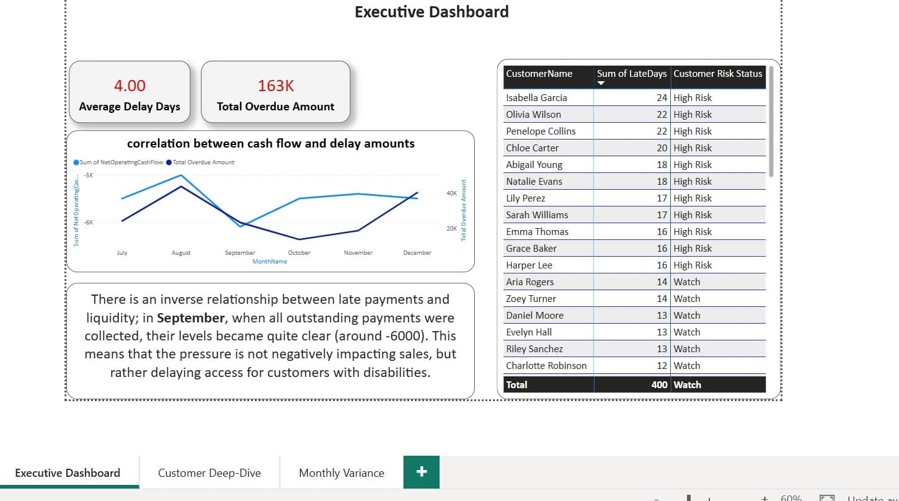
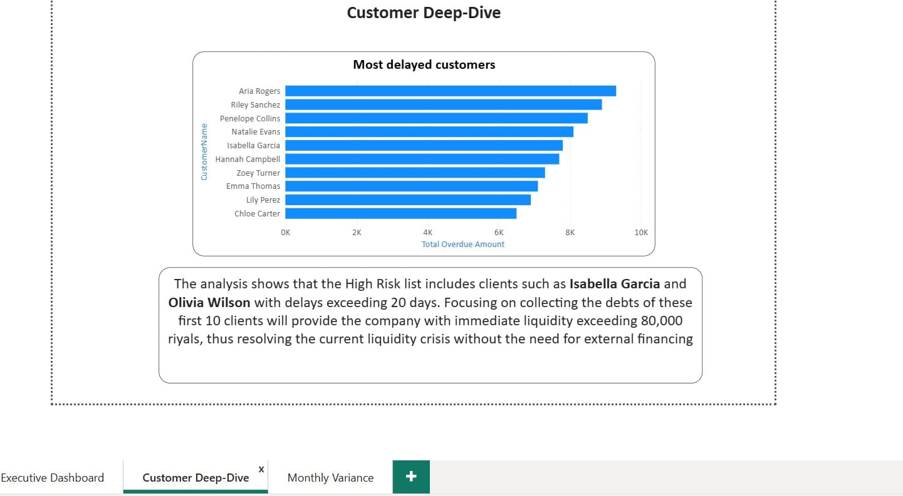
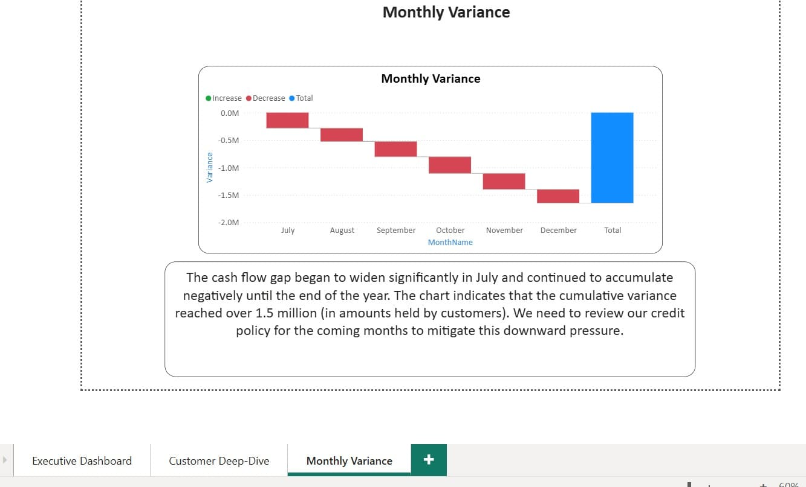

# Power-Bi---Cash-Flow-Risk-Analysis
A data analytics project focused on evaluating how customer payment behaviors affect the cash flow of a small business

## 📌 Overview
This project analyzes the relationship between customer payment delays and corporate liquidity. The goal is to identify financial gaps caused by credit sales and provide data-driven insights to mitigate credit risk and ensure a stable cash flow.

## 🏗️ Project Scenario
A small business selling products both in cash and on credit has noticed a trend of delayed payments over the last six months. The management needs to understand payment patterns and their direct impact on available operational cash.

## ❓ Analytical Questions
* Which customers have the highest payment delays?
* To what extent do these delays affect the company's available cash?
* Is there a measurable correlation between overdue amounts and cash flow dips?

## 💡 Hypothesis
> "Customers with frequent payment delays create significant pressure on liquidity, leading to potential operational cash shortages."

## 🛠 Tools & Skills
- Power BI Desktop  
- Power Query  
- DAX  
- Data Modeling  

---

## 📂 Dataset
All data tables are included in the `Dataset` folder as an Excel file.

---

## 📷 Dashboard Preview
Here are screenshots of the dashboard:

---

## 📦 Full Project
A complete project file is available as a pbix: `Cash Flow Risk Analysis.pbix`

